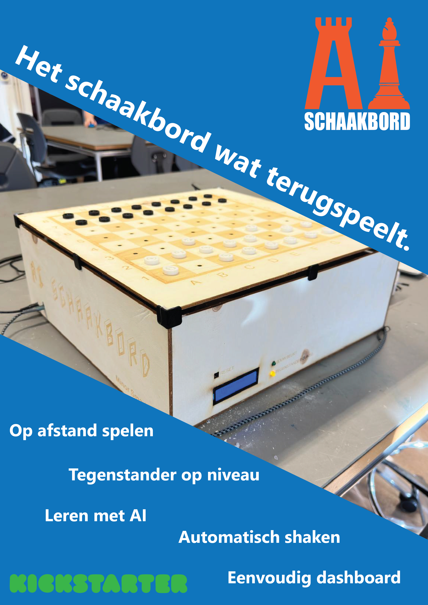

# MINSMT Kickstarter project minor Smart Things, Het slimme bordspel
Ontwikkeld door: [@Yonah](https://github.com/YonahHR), [@Roggerio](https://github.com/CodeWithRH), [@Jurian](https://github.com/1031333), [@Thomas](https://github.com/thomas-321).

Veel schakers maken gebruik van een website zoals chess.com om te oefenen en te spelen tegen andere spelers. 
Dit soort websites maken het weliswaar mogelijk om altijd en overal tegen mensen te spelen, maar mist de immersie van een fysiek bordspel.

Het slimme bordspel biedt herin een uitkomst. Het slimme bordspel maakt het mogelijk voor spelers, om net als op websites, tegen andere spelers te spelen waar deze zich ook bevinden en maakt het mogelijk om tegen een AI computer te spelen met wisselende moeilijkheidgraden.
Daarnaast biedt het slimme bordspel een fysieke ervaring door middel van een echt schaakbord en stukken. Zetten die een menselijke of AI tegenstander doen via het dashboard zullen automatisch door het schaakbord worden uitgevoerd alsof er een onzichtbare tegenstander in het echt de schaakstukken verplaatst.

## Features
- Speel tegen andere spelers, waar deze zich ook bevinden
- Speel tegen een AI computer met wisselende moeilijkheidgraden
- Fysieke ervaring door middel van een echt schaakbord en stukken
- Automatische uitvoering van zetten door het schaakbord
- Dashboard voor het beheren van spellen en tegenstanders

## Toekomstige uitbreidingen
In een latere fase van dit product zou product kunnen werken met één hoofdmodule (de behuizing en de bewegende armen) en submodules (bovenkant inc sensoren en microcontroller). 
Deze submodules zouden dan ook andere spellen kunnen zijn, zoals bijvoorbeeld Monopoly. 
Het aantal eindgebruikers zouden met deze modules dan substantieel verder kunnen groeien met elke nieuw ontwikkelde submodule.

## Het slimme bordspel in detail
### Het dashboard
Het dashboard is een webapplicatie die toegankelijk is via een browser. Hier kunnen bordspel eigenaren een schaakspel starten tegen een AI of menselijke tegenstander.

De verbinding tussen het dashbaord en het schaakbord wordt mogelijk gemaakt via een mqtt verbinding. 
Het dashboard wisselt de volgende informatie uit:
- Of het schaakbord of de tegenstander (AI of mens) mag beginnen (wit of zwart), wordt verstuurd naar het mqtt topic `{{code}}/boardcolor`.
- Zetten van de tegenstander (AI of mens) naar het schaakbord worden verstuurd naar het mqtt topic `{{code}}/move/external`. 
- Als een zet van het schaakbord illegaal is wordt dit verstuurd naar het mqtt topic `{{code}}/illegalmove`.
- Als een game afgelopen is, wordt dit verstuurd naar het mqtt topic `{{code}}/gameover`.
- Het dashboard subscribed op de topcis aangegeven in [Het schaakbord](#het-schaakbord).

### Het schaakbord
Het schaakbord is een fysiek bord dat beschikt over een 8x8 grid van schaakvakken. Elk vak is uitgerust met een sensor die detecteerd of er een schaakstuk op ligt.
Daarnaast heeft het schaakbord een mechanisme in het bord verwerkt dat in staat is om schaakstukken te verplaatsen door middel van een 2-assige systeem waarop een aanstuurbare magneet is bevestigd.

Ter indicatie biedt het schaakbord een display dat de code weergeeft die wordt gebruikt om verbinding te maken met het dashboard. Deze code is uniek en wordt ook gebruikt als mqtt topic voor de communicatie tussen het dashboard en het schaakbord. Naast het scherm is er ook een led aanwezig die weergeeft wanneer het bord aan de beurt is.

Het schaakbord wisselt de volgende informatie uit:
- Zetten van de tegenstander (AI of mens) naar het dashboard worden verstuurd naar het mqtt topic `{{code}}/move/board`.
- Elke 10 seconde stuurt het schaakbord een keepalive bericht naar het mqtt topic `{{code}}/alive/board` om aan te geven dat het bord nog steeds in leven is.
- Het schaakbord subscribed op de topics aangegeven in [Het dashboard](#het-dashboard).

---
